# lab3实验报告

## 1.实现思路
主要实现以下几个函数，完成基于网络的文件传输工具
**客户端**
- `void init_client(client* c, char* server_ip, ushort server_port, char* request_file,char* save_name)`: 初始化客户端，传入目标服务器的端口、ip地址、请求文件名、保存名称等参数
- `void request_show(client *c)`: 发送show指令，获取服务器上的文件列表
- `void request_get(client *c)`: 发送get指令，获取服务器上的文件
- `void request_size(client *c)`: 发送size指令，获取服务器上的文件大小
- `void bar_print(int finished,int cnt,char* proc)`: 打印下载进度条
- `int check_spilt(char* buf,int len)`: 检查buf中是否包含分隔符"&_",用于防止TCP粘包

**服务端**
- `void init_server(server* s, char* ip, ushort port, char* dir_root)`: 初始化服务端, 传入ip地址, 端口号, 以及文件根目录
- `void show_dir(server* s,int showHidden, int showSubDir)`: 显示目录, 传入是否显示隐藏文件, 是否显示子目录
- `void do_server(server* s)`: 服务端主循环，接收客户端连接，处理客户端请求
- `void handle_show(char* base_addr,int client_fd,int show_hide,int show_subdir)`: 处理客户端的show指令
- `void handle_get(int client_fd,char* filename);`: 处理客户端的get指令
- `void handle_size(int client_fd,char* filename)`: 处理客户端的size指令
- `void handle_request(void *arg)`: 客户端请求处理入口函数，新线程的执行函数
- `void send_file(int client_fd, char* filename)`: 发送指定文件(夹)给客户端

基本思路是服务端采用bind，listen，accpet对指定端口进行监听，当有客户端连接时，创建新线程，调用handle_request函数处理客户端请求，handle_request函数根据客户端发送的指令，调用相应的处理函数，处理函数根据指令，调用相应的函数，完成相应的功能。

## 2.测试输出结果

### 2.1 服务器端目录
<figure>
    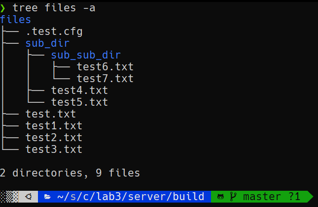
</figure>

### 2.2 命令参数
**客户端**
<figure>
    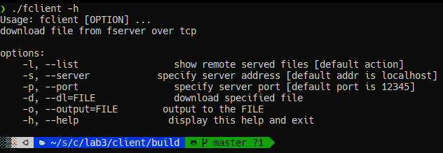
</figure>

**服务端**
<figure>
    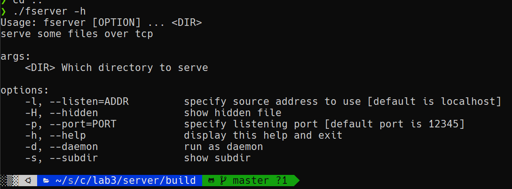
</figure>

### 2.2 使用服务器
#### 2.2.1 传输当前文件夹中文件，不要求子文件夹（默认）
<figure>
    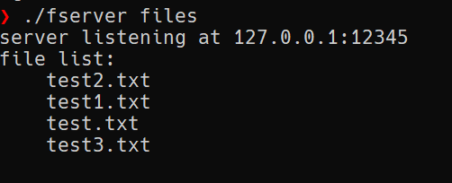
</figure>

#### 2.2.2 显示隐藏文件，并且指定6666端口
<figure>
    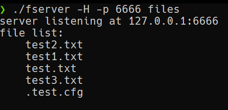
</figure>

#### 2.2.3 传输所有文件，把并且指定ip地址为127.0.0.1 端口6666
<figure>
    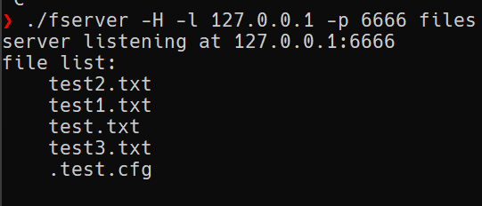
</figure>

#### 2.2.4 无效ip地址
<figure>
    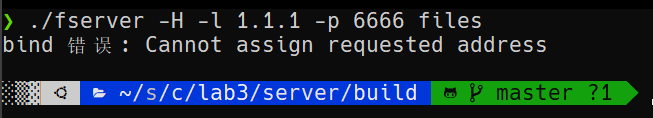
</figure>

#### 2.2.5 无效端口
<figure>
    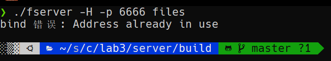
</figure>

### 2.3 使用客户端
服务器使用-H选项,默认localhost:12345
#### 2.3.1 显示服务器上的文件列表（默认，-l选项）
<figure>
    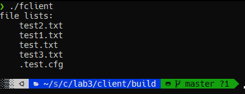
</figure>

#### 2.3.2 下载文件
<figure>
    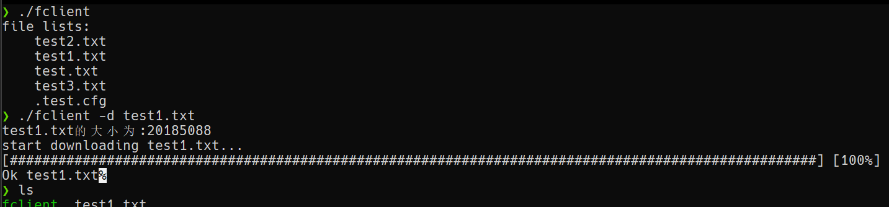
</figure>

#### 2.3.3 下载文件并且保存为指定名称
<figure>
    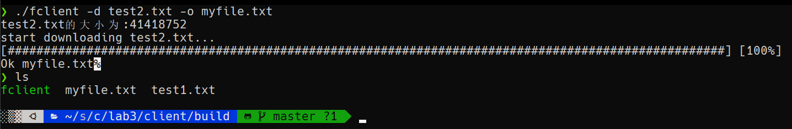
</figure>

#### 2.3.4 连接到指定ip地址和端口服务器
<figure>
    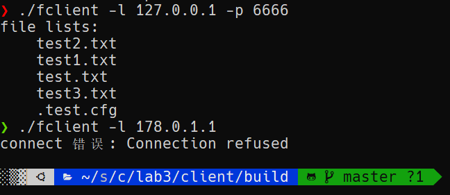
</figure>

## 3.扩展任务
### 3.1 将fserver设置为守护进程
加入守护进程的代码如下：
```c
void daemonize(){
    pid_t pid;
    pid = fork();
    if(pid<0){
        printf("fork error");
        exit(1);
    }else if(pid>0){
        //父进程直接退出
        exit(0);
    }
    //脱离原本会话
    setsid();
    chdir("./");
    umask(0);
    //删除守护进程的所有文件描述符
    int i = 0;
    for(i=0;i<getdtablesize();i++){
        close(i);
    }
}
```
在参数中加入以守护线程启动服务端的参数-d(--daemon)支持
<figure>
    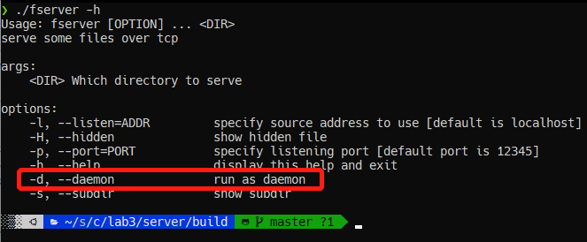
</figure>
以daemon模式启动服务端，可以看到服务器在后台正常启动
<figure>
    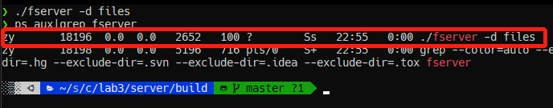
</figure>
此时客户端可以正常与服务端进行交互
