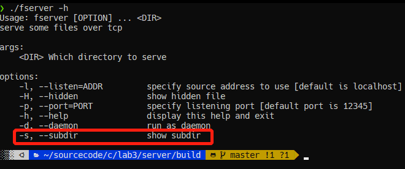
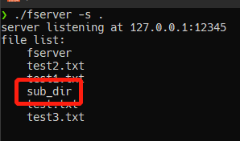
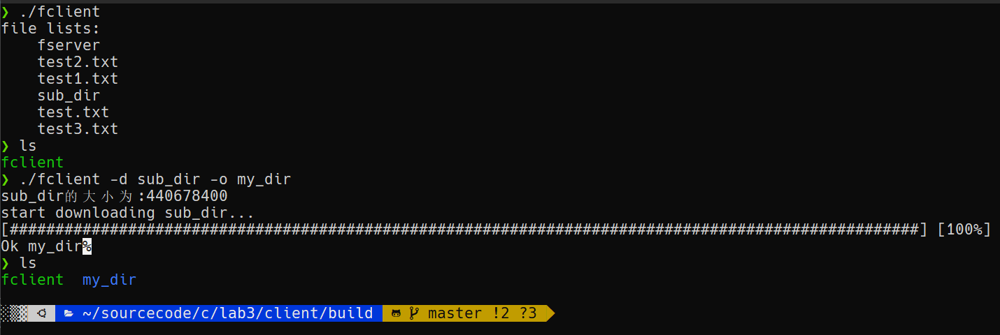
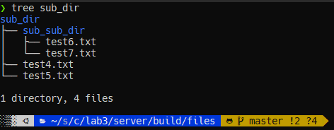
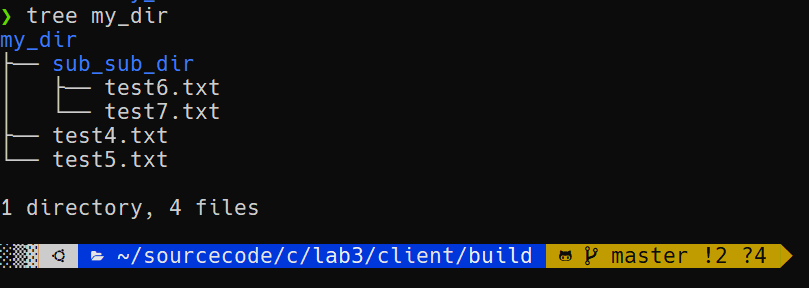
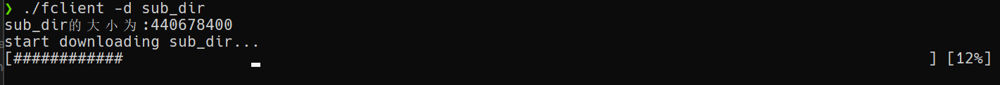
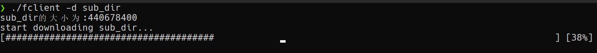
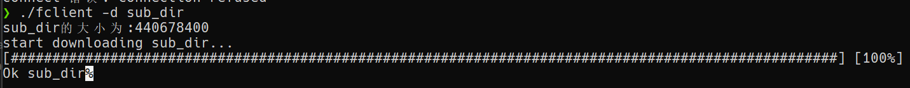
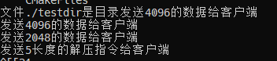
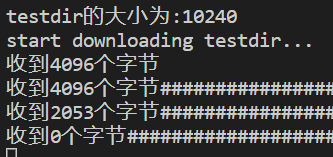

# lab3实验报告

## 1.实现思路
主要实现以下几个函数，完成基于网络的文件传输工具
**客户端**
- `void init_client(client* c, char* server_ip, ushort server_port, char* request_file,char* save_name)`: 初始化客户端，传入目标服务器的端口、ip地址、请求文件名、保存名称等参数
- `void request_show(client *c)`: 发送show指令，获取服务器上的文件列表
- `void request_get(client *c)`: 发送get指令，获取服务器上的文件
- `void request_size(client *c)`: 发送size指令，获取服务器上的文件大小
- `void bar_print(int finished,int cnt,char* proc)`: 打印下载进度条
- `int check_spilt(char* buf,int len)`: 检查buf中是否包含分隔符"&_",用于防止TCP粘包

**服务端**
- `void init_server(server* s, char* ip, ushort port, char* dir_root)`: 初始化服务端, 传入ip地址, 端口号, 以及文件根目录
- `void show_dir(server* s,int showHidden, int showSubDir)`: 显示目录, 传入是否显示隐藏文件, 是否显示子目录
- `void do_server(server* s)`: 服务端主循环，接收客户端连接，处理客户端请求
- `void handle_show(char* base_addr,int client_fd,int show_hide,int show_subdir)`: 处理客户端的show指令
- `void handle_get(int client_fd,char* filename);`: 处理客户端的get指令
- `void handle_size(int client_fd,char* filename)`: 处理客户端的size指令
- `void handle_request(void *arg)`: 客户端请求处理入口函数，新线程的执行函数
- `void send_file(int client_fd, char* filename)`: 发送指定文件(夹)给客户端

基本思路是服务端采用bind，listen，accpet对指定端口进行监听，当有客户端连接时，创建新线程，调用handle_request函数处理客户端请求，handle_request函数根据客户端发送的指令，调用相应的处理函数，完成相应的功能。

## 2.测试输出结果

### 2.1 服务器端目录
<figure>
    
</figure>

### 2.2 命令参数
**客户端**
<figure>
    
</figure>

**服务端**
<figure>
    
</figure>

### 2.2 使用服务器
#### 2.2.1 传输当前文件夹中文件，不要求子文件夹（默认）
<figure>
    
</figure>

#### 2.2.2 显示隐藏文件，并且指定6666端口
<figure>
    
</figure>

#### 2.2.3 传输所有文件，把并且指定ip地址为127.0.0.1 端口6666
<figure>
    
</figure>

#### 2.2.4 无效ip地址
<figure>
    
</figure>

#### 2.2.5 无效端口
<figure>
    
</figure>

### 2.3 使用客户端
服务器使用-H选项,默认localhost:12345
#### 2.3.1 显示服务器上的文件列表（默认，-l选项）
<figure>
    
</figure>

#### 2.3.2 下载文件
<figure>
    
</figure>

#### 2.3.3 下载文件并且保存为指定名称
<figure>
    
</figure>

#### 2.3.4 连接到指定ip地址和端口服务器
<figure>
    
</figure>

## 3.扩展任务
### 3.1 将fserver设置为守护进程
加入守护进程的代码如下：
```c
void daemonize(){
    pid_t pid;
    pid = fork();
    if(pid<0){
        printf("fork error");
        exit(1);
    }else if(pid>0){
        //父进程直接退出
        exit(0);
    }
    //脱离原本会话
    setsid();
    chdir("./");
    umask(0);
    //删除守护进程的所有文件描述符
    int i = 0;
    for(i=0;i<getdtablesize();i++){
        close(i);
    }
}
```
在参数中加入以守护线程启动服务端的参数-d(--daemon)支持
<figure>
    
</figure>
以daemon模式启动服务端，可以看到服务器在后台正常启动
<figure>
    
</figure>
此时客户端可以正常与服务端进行交互
<figure>
    
</figure>

### 3.2 服务器支持子目录传输
考虑到传输效率以及还原文件夹结构的方便性，服务器支持子目录的主要实现方式是将原文件夹打包，然后传输打包文件，客户端接收到打包文件后解压缩。
在参数中加入以支持子目录传输的参数-s(--subdir)支持
<figure>
    
</figure>
服务器以-s参数启动对文件夹的支持
<figure>
    
</figure>
客户端下载sub_dir文件夹并且重命名为my_dir：
<figure>
    
</figure>
查看my_dir文件结构，与sub_dir一致：
<figure class="half">
    
    
</figure>

### 3.3 服务器支持进度条

主要实现方式是客户端在获取文件之前，首先向服务器发送size指令，得到文件大小，客户端通过每次recv收到的字节数来判断当前的进度。

<figure class="third">
    
    
    
</figure>

## 4.记录实验中遇到的一个有意思的bug
### 4.1 问题描述

在我写OS的lab3时，遇到了一个非常奇怪的bug，由于文件夹的传输是通过压缩后再解压缩来完成的，因此在文件夹传输完毕后，需要额外发送一条指令（长度为5的unzip指令）来告诉客户端解压，以便恢复文件夹的文件结构。 

但是问题就出在这条额外指令上，当所有传输的文件数据结束后，客户端怎么也收不到这条长度为5的指令，每次接收完数据后，其recv方法总是直接返回0，导致无法正常还原文件夹结构；而在服务器这边，服务器的日志显示服务器确实发送了这条指令，且服务器没有在发送额外指令之前就关闭socket。

### 4.2 问题分析

在输出服务器端和客户端每次发送和接收的字节后，我发现了问题：

**服务端日志**
<figure>
    
</figure>

**客户端日志**
<figure>
    
</figure>

服务器一共发送了4次，分别是4096、4096、2048以及5，而客户端只接收了3次，分别是4096，4096，2053。这就是问题所在，客户端接收到的最后一次数据长度为2053，而不是2048，也就是说客户端将服务端发送的最后一个数据包和额外的指令包一起取到自己的buf中了。


很显然，这里出现了TCP粘包的问题。TCP是面向字节流的协议，它并不会区分哪些字节是数据，哪些是指令，也不保证按照你能够完全收到与send一致的报文，它只保证你发送的这些字节能够按序的、以流的方式送到客户端。

### 4.3 解决方案

要解决TCP粘包问题，我们可以从协议本身和服务器端两方面下手：
- 对于服务器端，我们可以选择将nagle算法关闭
- 然而，仅仅关闭nagle算法是不够的，即使服务器每次不等缓冲满就send，客户端仍然有可能等到缓冲区满才接收，也就是说，客户端可能会等到多个包都到达缓存后，一次性的取多个包上来，这样也会造成粘包。因此最好的解决的办法是从协议下手
  - 约定好每个可解析报文的长度，这样每次都只解析固定长度的报文
  - 用特殊字符来标识数据、指令的终结，如HTTP的\r\n
  - 采用前缀，在发送时告知客户端本次消息有多少字节

首先，我在服务端关闭了nagle算法：
```c
        //禁用negle算法
        setsockopt(client_fd,IPPROTO_TCP,TCP_NODELAY,(void*)&enable,sizeof(enable));
```

之后，我在每次发送完文件(夹)之后，都在文件的结尾添加一个"$_"作为文件传输完毕的标志；每次客户端recv拿到buf后，都需要检查buf中是否有这个标志，如果有，则需要对buf进行解析，而不是直接将其写入文件的fd中。
```c
    //s端文件传输完毕，发送分隔符
    memset(file_buf,0,MAXBUF);
    strcpy(file_buf,"$_");
    send(client_fd,file_buf,strlen(file_buf),0);

    ...

    //c端检查buf中是否含有分隔符
    int lastNum = check_spilt(buf,n);
    if(lastNum!=-1){
        //有分隔符，执行相应解析操作
        ...
    }
    else{
        //没有分隔符，正常写入文件
        ...
    }
```

最后问题顺利解决。